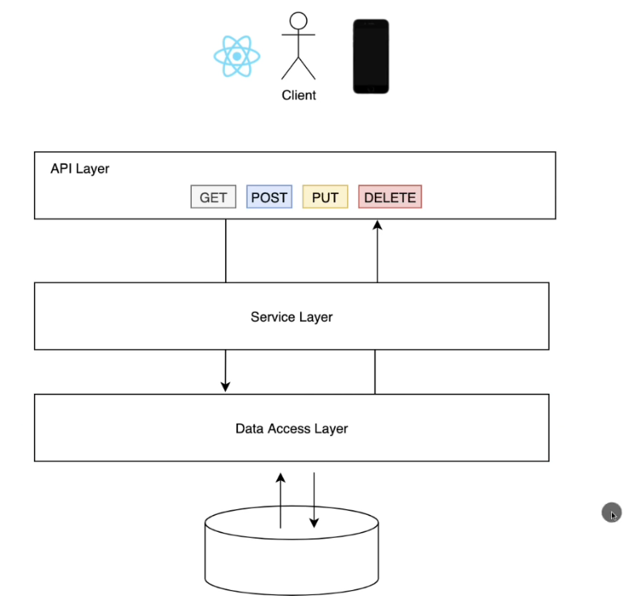

# Trying to understand Java Springboot
## Concepts

A simple CRUD api contains Students and Courses Relationship. 

A single can take many courses and a course can have many students enrolled. 

Student model.

| Type             | Data    |
|------------------|---------|
| Long             | id      |
| String           | name    |
| String           | email   |
| LocalData        | dob     |
| Transient Integer | age     |
| Objects List     | Courses |

Course model.

| Type         | Data    |
|--------------|---------|
| Long         | id      |
| String       | name    |
| String       | code    |
| Objects List | Student |

